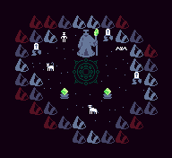
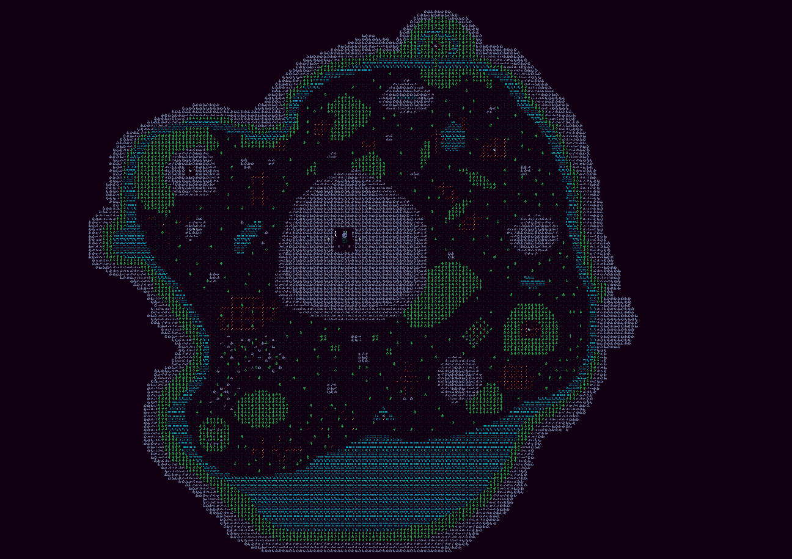

#

> ​Control skeletons and make them do your bidding!

#

### How to play:
* Use the buttons on the hotbar to interact with the world
* Middle click to drag the map
* View your summons on the left and click them for their details

### Hotbar icons:
* Pickaxe: use the pickaxe to indicate where you want your skeletons to mine.
* Eye: use the eye to get your skeletons to scout out an area
* Farm: builds a farm which will grow a tree for your skeletons to harvest
* Mana Collector: builds a collector which will collect mana for your * skeletons to harvest
* Grave: builds a grave which grants you an extra skeleton (and a place for * him to sleep)
* Watchtower: builds a watchtower where your skeletons will keep patrol and * provide a large vision radius

> [!NOTE]
> * We've hidden some Easter-eggs, let us know if you find them!!
> * GDScript isn’t the best language for this kinda thing, so apologies for the lag!

## Screenshots:

